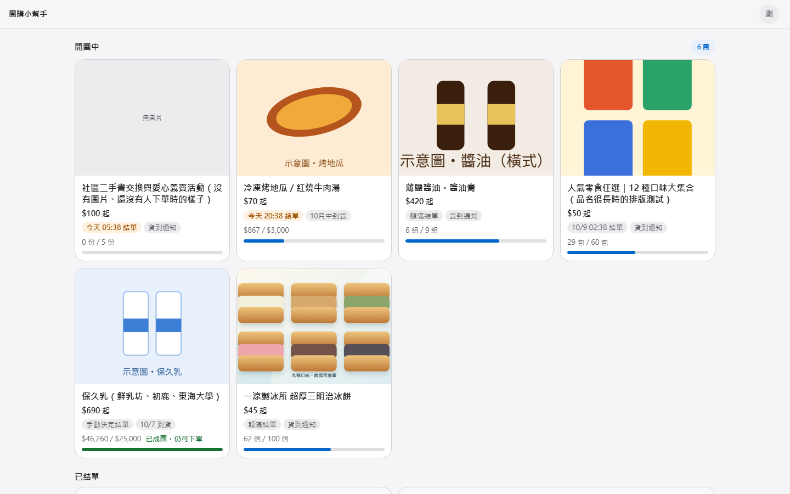
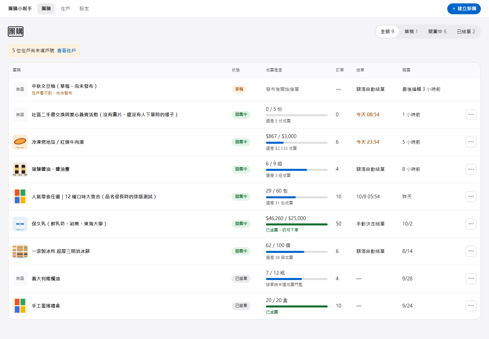

# 團購小幫手

以 LINE 為入口的社區團購工具：保留記事本式的公開訂單與成團進度，讓團主不用再從留言手動統計，同時把住戶的戶別與身分資料留在受權限保護的路徑。

[](https://github.com/Pengziyuu/group-buy-helper/actions/workflows/ci.yml)
[](https://github.com/Pengziyuu/group-buy-helper/actions/workflows/production-check.yml)

[正式入口](https://tuan-go.vercel.app/) · [技術架構](docs/ARCHITECTURE.md) · [LINE 領取通知設計](docs/line-pickup-notifications.md) · [維護交接](docs/AI_AGENT_HANDOFF.md)

> **體驗說明**：正式站需 LINE 登入；新住戶須符合已綁定正式群組的入會規則，團主帳號另須核准，因此公開網址不是免登入的體驗站。下方畫面取自**本機示範模式**，不代表正式環境資料。

## 解決什麼問題

社區團購常在 LINE 記事本下單：大家想看到誰買了什麼、目前是否成團，但團主仍得人工彙整品項、處理超額與通知領貨。團購小幫手把這些工作拆成住戶下單、團主核對和受控的 LINE 通知流程；公開訂單牆保留熟悉的參與感，卻不公開期別、戶號或 LINE 帳號識別碼。

## 畫面（本機示範資料）

**住戶團購列表**：已發布團購分為開團中／已結單，顯示商品、結單資訊與成團進度。



**團主團購列表**：集中查看草稿、開團中、已結單，以及各團的訂單數和進度。



這些畫面使用原始碼中的 Demo 素材及資料；正式站有 LINE 驗證、Supabase 權限和不同的實際內容。沒有使用正式住戶資料製作截圖。

## 功能與設計取捨

- **住戶**：以 LINE 身分進入社區已發布團購列表；查看公告、圖片、品項價格及公開訂單牆，建立或修改自己的訂單。品項可顯示真實名稱、口味與優惠後價格；可選的「額外品項」標示金額另計，不混入正式成團統計。
- **團主**：編輯草稿並於發布前檢查，發布後管理訂單、備註、住戶、範本與圖片；結單後匯出含公式的 `.xlsx` 明細。已發布內容與草稿隔離，避免未發布修改流到住戶端。
- **門檻與價格**：支援數量／總金額門檻、可選的達標自動結單、基本折扣及指定商品任選優惠；折後成交價由資料庫交易中的訂單快照保存，數量型自動結單的超額限制在資料庫端執行。
- **LINE 通知**：領取通知按團購建立短效、一次性群組指令，由已核准團主貼到已綁定群組後才由 Bot Reply；正式／測試群組與入口分離。排定或達標自動結單另以 outbox／worker 通知指定團主，不等同於群組領取通知。
- **隱私界線**：住戶訂單牆可看驗證過的顯示名稱、品項與時間，卻不回傳戶別；自己的戶別走私有路徑，團主視圖才可讀必要戶別。資料庫使用 RLS、欄位權限及受限函式，而非僅在畫面隱藏欄位。

付款不在此系統收取；團主以匯出的明細在系統外處理。這是一個**單一社區部署**，不是多租戶 SaaS。更多資料流、權限與邊界見[技術架構](docs/ARCHITECTURE.md)。

## 技術組成

- **前端**：React 19、TypeScript、Vite、Tailwind CSS；住戶與團主共用元件，但各有路由及授權流程。
- **資料與服務**：Supabase PostgreSQL、Auth、RLS、RPC、Realtime、Storage、Edge Functions 與排程；LINE LIFF／Messaging API 負責身分與通知。
- **部署與品質**：Vercel 正式站及分享頁預覽；GitHub Actions 執行 lint、測試、建置、從空資料庫套用 migration／權限驗證、Edge Function 型別檢查與正式網址 smoke check。

```text
LINE LIFF ──身分驗證──> Supabase Edge Functions ──> Supabase Auth
    │                                              │
    └──> Vercel（React 住戶／團主頁） ──> RLS／RPC／安全視圖 ──> PostgreSQL
                    │                     │
                    └── Realtime／Storage └── 排程與通知 worker ──> LINE Messaging API
```

## 在本機試用

需要 Node.js `>=22.12.0`。先試**不連正式資料庫**的瀏覽器 Demo：

```bash
npm ci
npm run dev
```

開啟 `http://localhost:5173/`（住戶）或 `http://localhost:5173/admin`（團主）。**沒有提供 Live 環境變數時**才會進入 localStorage Demo；若你的電腦已有 `.env.local`，請先檢查其指向，避免誤連正式資料庫。此模式不能驗證 LINE 登入、跨裝置同步、Storage、資料庫 RLS 或正式通知。

需要驗證資料庫行為時，安裝 Docker Desktop 並啟動本機 Supabase，再使用本機 Live Demo 啟動器：

```bash
npx supabase start
npx supabase db reset --local --yes
python scripts/start_local_live_demo.py
```

啟動器在 `http://localhost:5174/`／`/admin` 開啟本機 Supabase 模式，並在終端顯示**僅限可丟棄本機資料庫**的測試團主登入資訊。此模式可驗證本機 Auth、RPC、RLS、Storage 與 Realtime；不等於正式 LINE LIFF／群組通知端到端驗收。不要把本機測試帳號或 service-role key 用於正式環境。

要自行設定 Live 前端，參考 [`.env.example`](.env.example)；`VITE_` 變數會進入瀏覽器 bundle，**只能放 Supabase 公開金鑰與 LIFF ID，不能放 secret／service-role key**。正式部署還需 LINE、Supabase Edge Function secrets、群組綁定和團主核准，請依[維護交接](docs/AI_AGENT_HANDOFF.md)確認順序，勿只複製 `.env.example` 就連到正式資料。

## 驗證與部署

```bash
npm test
npm run lint
npm run build
```

資料庫 migration、SQL 權限測試與 `scripts/verify_*` 行為驗證由 [CI](.github/workflows/ci.yml) 在可丟棄的本機 Supabase 上執行。已部署的 migration 是重建歷史，**不要刪改舊檔**；新的資料庫變更先本機重建，再對正式環境 dry-run、手動套用並讀回權限／結構，最後透過受保護的 `main` 分支 PR 合併。Vercel 部署完成後由 [Production check](.github/workflows/production-check.yml) 驗證固定網址；登入後的 LINE 真實操作仍需具備權限的帳號驗收。

## 專案地圖

- [`src/RuntimeApp.tsx`](src/RuntimeApp.tsx)、[`src/routing.ts`](src/routing.ts)：Demo／本機 Supabase／正式 LIFF 模式與網址路由。
- [`src/LocalLiveApps.tsx`](src/LocalLiveApps.tsx)：正式環境的 Auth 與資料接線；畫面元件在 `src/components/resident/`、`src/components/organizer/`。
- [`src/domain/`](src/domain/) 與 [`src/services/`](src/services/)：價格、訂單領域邏輯，Supabase gateway 與匯出。
- [`supabase/migrations/`](supabase/migrations/) 與 [`supabase/functions/`](supabase/functions/)：資料庫歷史、身分驗證及通知邊界；`supabase/seed.sql` 僅供本機示範。
- [`api/campaign-preview.ts`](api/campaign-preview.ts)：分享連結的公開預覽中介層，不將草稿或私有資料作為公開預覽。

## 授權與重用

本 repository 目前**沒有附帶開源授權檔**；公開可讀不等於授權重用。若要以本專案作為範本，請先與維護者確認授權。產品設計與部署注意事項見[維護交接](docs/AI_AGENT_HANDOFF.md)。
